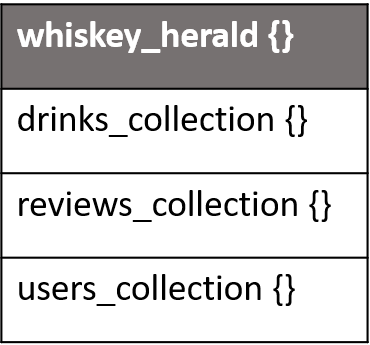
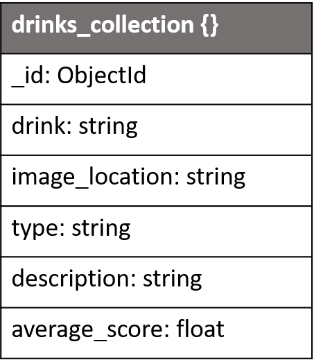
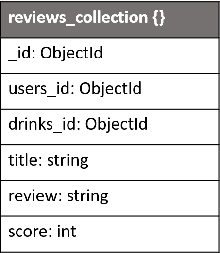
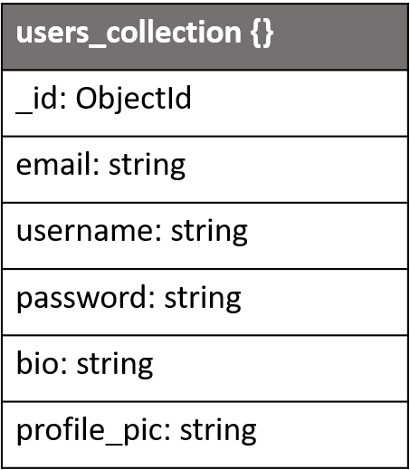

# Whiskey Herald

Whiskey Herald is a collaborative community where users can contribute to updating a database with information on all their favourite whiskeys. 
This should facilitate community building and provide a meaningful experience to the user. A user can then leave reviews of their favourite whiskeys
 with CRUD functionality on their own reviews.
 The project should be of interest to new users looking to become a part of the whiskey enthusiast community, and 
 veteran users who want to maintain a strong community and share their own thoughts of their favourite whiskeys.

# UX

## Project Goals

-	Develop a website with an intuitive design that helps the user accomplish their goals. [1]
-	Provide the user with a meaningful experience. [2]
-	Build a website in line with good coding practices. [3]

## User Goals

-	Provide filtered lists of whiskeys that may appeal to various user interests. E.g. Sort whiskeys by type, rating, most reviews, etc. [4]
-	Search the database with custom keywords.  [5]
-	A website with a familiar enough design that I can focus on accomplishing my goals rather than learn how to use the website. [1]
-	Feel that use of this website is a meaningful use of my time. [2]
-	Accessible design. [6]

[1] Following Jakob’s law I will use Bootstrap to customise my website with well used and tested designs so that a user can immediately begin to accomplish their goals rather than risk them being overwhelmed with having to learn how to navigate an unfamiliar website.
[2] All users will be able to update the information on whiskeys so that the database is up to date and they may contribute to a community of like-minded individuals.
[3] HTML and CSS will be passed through validators, JavaScript will be passed through a linter, and Python will be written in accordance with PEP8 practices.
[4] The home page will feature some filtered whiskey lists that a user may scroll through.
[5] The user will be provided with a search bar that will allow them to navigate the database for what they are looking for.
[6] The website will adhere to good practices for ensuring that it is accessible for users with visual impairment.

# wireframes

[View wireframes](WIREFRAMES.md)

# database

## drinks_collection {}
This collection contains all drinks that are displayed on the website. Any registered user can create and update documents within this collection. Only the website admin can delete these documents, so a malicious user cannot start deleting documents. 

## reviews_collection {}
This collection contains all the reviews written to the website. Any registered user can write a review, update their review, or delete it.

## users_collection {}
This collection contains all the data on registered users. A user writes to this collection when registering. These can delete their own document if they choose to delete their account. Some fields can be updated by the user.

## _id 
The ObjectId of this document.
## drink 
The name of the drink. E.g. Jameson’s
## image_location
The location of the image in the static directory.
## type
The whiskeys type e.g. Irish
## description
A description of the drink.
## average_score
This is the average score of the drink, its value is calculated by totaling the scores from each review and finding the mean.

## _id
The ObjectId of this document.
## users_id
The ObjectId of a users_collection document. So a unique user can be identified as the author of this review.
## drinks_id
The ObjectId of a drinks_collection document. So the review can be attached as unique to an individual drink.
## title
The title of this review
## review
The review itself.
## score
An integer value of 1,2,3,4,5. 5 star rating.

## _id
The ObjectId of this document.
## email
The users unique email.
## username
the users unique username
## password
the users hashed password.
## bio
The users biography.
## profile_pic
A path to the users profile picture in the static directory.

# Credits
## Acknowledgements

Laws of UX: Using Psychology to Design Better Products & Services – Jon Yablonski
Flask Web Development: Developing Web Applications with Python – Miguel Grinberg

