# Testing

[return to README.md](README.md)

## User Stories

### [1]:
- Using the search bar located in the header, the user can type in the name of the whiskey they want to view. 
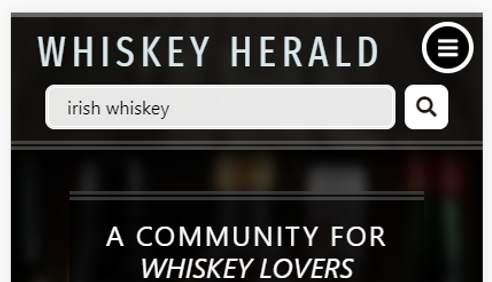
- Submitting the form will bring the user to search.html where their search results will be displayed. If the whiskey they are searching for exists its image, name, and average 5 star score will be displayed. 
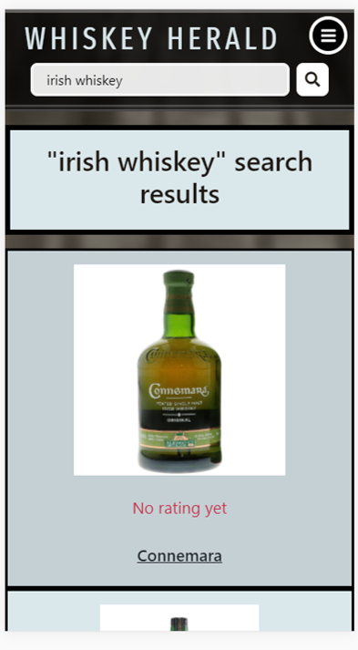
- Clicking on the box that contains the image, name, and score will display whiskey.html/<whiskey_name>. A list of reviews for this whiskey will be found below the whiskey details. Whether this particular goal 
for an individual is acomplished though is dependent upon other users; the whiskey might not exist until someone adds it, or the whiskey might exist but have no reviews yet. As more users join the website this 
problem should become less of an issue for future users.
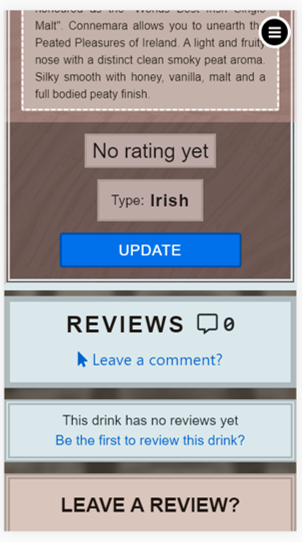
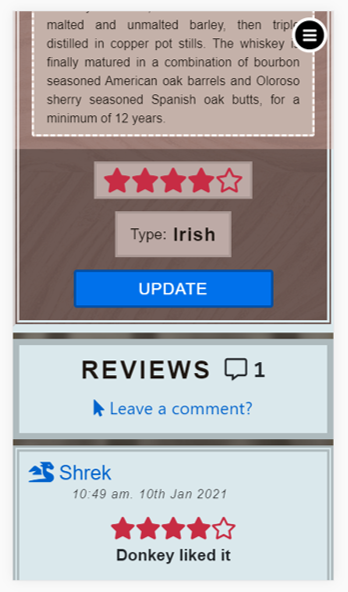

### [2]: 
- A user might search for a whiskey that does not exist. If no search results are found a message will display on search.html informing the user that their search has returned no results, and
the user will be provided with a link to add-whiskey.html where they can add the whiskey they are looking for.
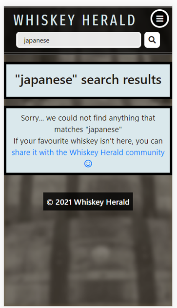
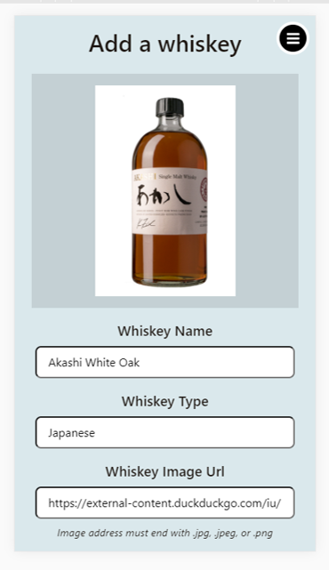
- After the whiskey is added, the user will be redirected to whiskey.html/<whiskey_name> where they can now view, and review the whiskey they added. 
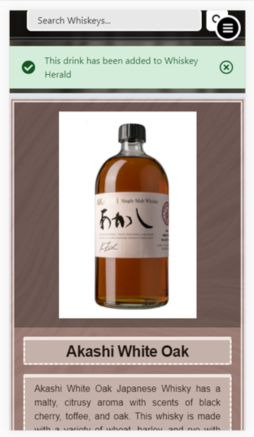

### [3]:
- In the sidenav the first nav-item for a logged in your will be a link to their profile page.
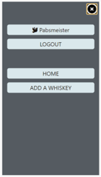
- Below the bio is displayed a settings icon which when selected will give the user access to "update profile."
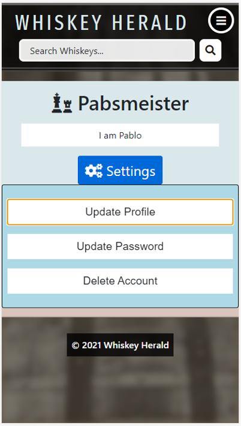
- Here the user may update their username, profile icon, and bio. At the top of this modal will be displayed a preview of the inputted username and selected profile icon. 
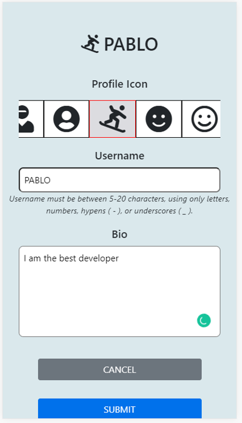
- Upon submitting this form, the profile page will be reloaded and a flash message will appear informing the user whether or not their profile has been updated.
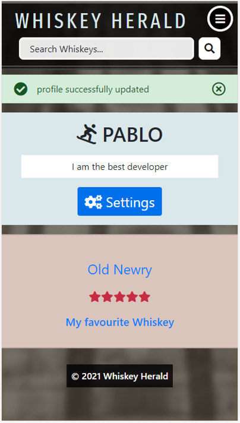
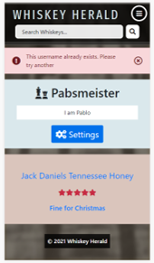

### [4]:
- In the users profile page, within the settings button they can select "update password."
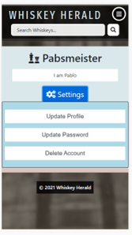
- A modal will be displayed where the user can enter in their new password.
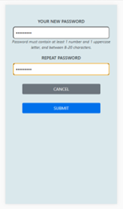
- Upon submission of the form, their profile will be reloaded with a flashed message informing them if the update was successful or not.
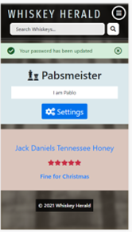
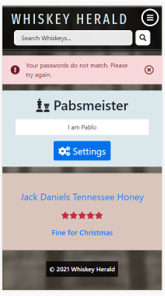

### [5]: 
- Any action where a user is creating, updating, or deleting data from the database will return a flash message to inform the user if an action has been successful or not. If not successful
a message will be provided as to why it was unsuccessful.
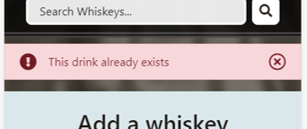
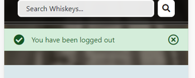
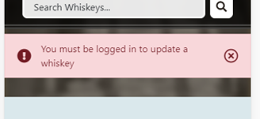
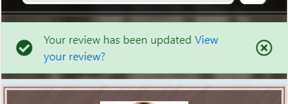

### [6]: 
- On the users profile page will be displayed a list of their reviews. Clicking on the title of their review will bring them to their review on whiskey.html/<whiskey_name>. 
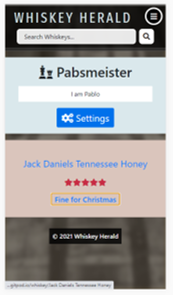
- At the top right of their review is an options button that if selected will display the options to update and delete their review. 
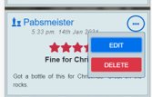
- Selecting update will scroll the user to the review form at the bottom of the page, with all fields filled out ready to be updated.

- Upon submission, the page will reload and a flash message will inform the user that their review has been updated, and a link to their review will be included in the flash
message so they don't have to scroll back down the page.
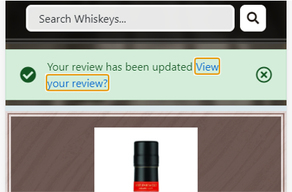

### [7]:
- Following the same process as in [6], an option a user can select in the options menu of their review is to delete it.

- Selecting this button will display a modal with a message asking the user if they would like to delete their review. If the user clicked this option by accident this modal gives them the
opportunity to select cancel and exit this modal. If the user is sure they want to delete their review, then selecting the delete button in this modal will reload the page and display a flash message
informing them that their review has been deleted. 
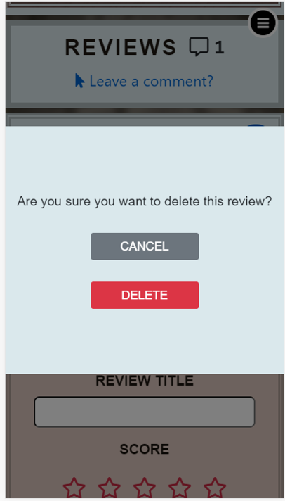
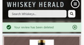
- Returning to the reviews of the whiskey, or their profile page the user will notice that the review no longer exists.
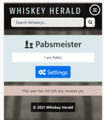

### [8]:
- When a user is on a whiskeys page, there will be an update button below the whiskeys type. Selecting this while not logged in will redirect the user to login.html. 
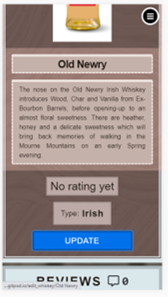
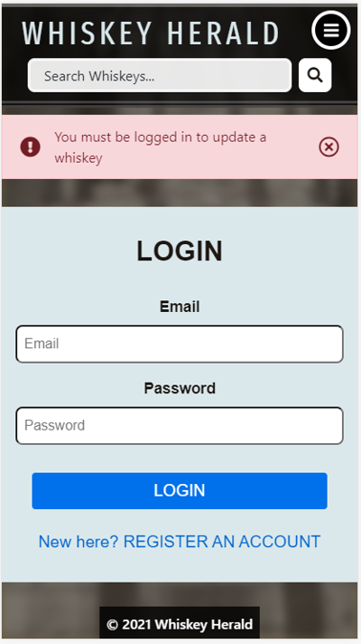
- If a user is logged in then selecting this will bring the user to edit-whiskey.html/<whiskey_name>. The form is identical to that in add-whiskey.html. All input fields will have the whiskey 
information filled ready for updating.
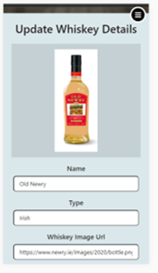
- If the user wishes to cancel, selecting the cancel button will bring them back to the whiskey page. If they want to continue with the update, then they will be returned to the updated whiskey page
with a flash message informing them whether or not the update was successful.
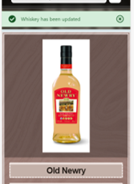

### [9]:
- On a whiskey page will be a form at the bottom where a user can write a review. At the top of the reviews will be a link that will scroll the page to the form if clicked, or the user can scroll 
themselves. 
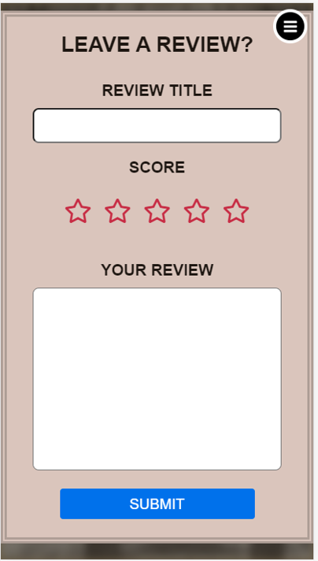
- Submitting this form will reload the page and inform the user if their review has been submitted successfully. A link to the review will be included in the flash message so the user does not have
the scroll down to the review themselves.
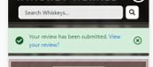

## Functionality

### base.html

action taken | expected result | pass/fail
------------ | --------------- | ---------
entered a value into #search form and submitted it. | search.html loads with my value displayed and its query results | pass
Clicked #navbar-toggle multiple times | #sidenav is toggled between being displayed and hidden. | pass
focus on #navbar-toggle and pressed enter key multiple times | #sidenav is toggled between being displayed and hidden. | fail
When not logged in, display #sidenav | Log in and Register links should display | pass
When logged in, display #sidenav | A link to my profile page with my username and profile icon should display, and below that an option to logout. | pass
clicked Log In within #sidenav | display login.html | pass
clicked Register within #sidenav | display register.html | pass
clicked my username within #sidenav | display my profile page. Profile.html/<username> | pass
clicked Logout within #sidenav | display login.html and a flashed message | pass
clicked Home within  #sidenav | display index.html | pass
clicked Add a Whiskey within #sidenav while not logged in. | display add-whiskey.html and flash message | pass
clicked Add a Whiskey within #sidenav while logged in. | display add-whiskey.html and flash message | pass
focused on Log In within #sidenav and pressed enter | display login.html | pass
focused on Register within #sidenav and pressed enter | display register.html | pass
focused on my username within #sidenav and pressed enter | display my profile page. Profile.html/<username> | pass
focused on Logout within #sidenav and pressed enter | display login.html and a flashed message | pass
focused on Home within #sidenav and pressed enter | display index.html | pass
focused on Add a Whiskey within #sidenav while not logged in and pressed enter | display add-whiskey.html and flash message | pass
focused on Add a Whiskey within #sidenav while logged in and pressed enter | display add-whiskey.html and flash message | pass

### search.html

action taken | expected result | pass/fail
------------ | --------------- | ---------
inputted a search value that returns no results | display search.html with a message saying no results could be found and a link to add-whiskey.html | pass
clicked link to add-whiskey.html | display add-whiskey.html. If I am not logged in, display a flash message also | pass
Focused on link for add-whiskey.html and pressed enter key | display add-whiskey.html. If I am not logged in, display a flash message also | pass
inputted a value that returns results | display search.html with all drinks that match the query. They should have an image, rating, and name. | pass
Clicked one of the search results | display custom page for the whiskey I clicked on, the same name, rating, and image. Display whiskey.html/<whiskey_name> | Pass
Focused on a search result and pressed enter key | display custom page for the whiskey I clicked on, the same name, rating, and image. Display whiskey.html/<whiskey_name> | pass
Inputted a misspelled search value. e.g scatch instead of scotch | display "no results for scatch" Did you mean "scotch"? | fail

### profile.html

action taken | expected result | pass/fail
------------ | --------------- | ---------
Visit my profile page | #dropdownMenuButton should be displayed | pass
Visit another users profile page | #dropdownMenuButton should not be displayed | pass
Click #dropdownMenuButton | List of options to edit profile should display | pass
focus on #dropdownMenuButton and press enter | List of options to edit profile should display | pass
click update profile | display a form that allows me to update my username, profile icon, and bio. | pass
focus on update profile and press enter | display a form that allows me to update my username, profile icon, and bio, with my current profile icon highlighted and displayed next to my current username | fail
click update password | display a form that sllows me to update my password | pass
focus on update password and press enter | display a form that sllows me to update my password | fail
click delete account | display a message asking if I would like to delete my account | pass
focus on delete account and press enter | display a message asking if I would like to delete my account | fail
for update profile form, clicked on a new profile icon | the clicked icon will be highlighted and previewed at the top of the form next to my username | pass
for update profile form, focused on a new profile icon and pressed enter | the clicked icon will be highlighted and previewed at the top of the form next to my username | fail
for update profile form, enter a new value into username field | My username preview will be updated | pass
submit form with invalid username format | a message appears asking the user to match the requested format | pass
submit form with an already existing username | flash error message appears informing the user that the username is unavailable | pass
submit form with username unchanged | flash success message appears informing the user that their profile has been updated. | pass
clicking cancel button | #modal should hide | pass
focusing on cancel button and pressing enter key | #modal should hide | fail
submitting form with valid inputs | my profile page should display with flash success message and the items I updated now clearly changed to what I selected | pass
submitting update password form with invalid format | message should appear informing the user to match the required format. | pass
submitting update password form with non matching passwords | display profile page with flash error message informing the user that their passwords do not match | pass
submitting update password with matching passwords | display flash succecss message informing me that my password has been updated | pass
logout and log in again after updating password, with old password | display login.html with flash error message informing the user that the email/password is incorrect | pass
logout and log in again after updating password, with updated password | display profile page with flash success message informing the user that they have successfully logged in | pass
clicking cancel button within delete account | #modal should hide | pass
focusing on cancel button and pressing enter key within delete account | #modal should hide | fail
clicking delete button within delete account | register.html should load with flash success message informing the user that their account has been successfully deleted. | pass
focusing on delete button within delete account and pressing enter | register.html should load with flash success message informing the user that their account has been successfully deleted. | pass
visiting a profile page with no reviews | a message should be displayed showing that the user has left no reviews yet | pass
visting a profile page for a user who has left reviews. | All reviews by the user should be displayed with the whiskey name, rating, and review title | pass
clicking whiskey name in review | display the whiskeys page. Whiskey.html/<whiskey_name> | pass

### register.html

action taken | expected result | pass/fail
------------ | --------------- | ---------
submit empty form | message appears asking user to fill in email field | pass
submit value "a" in email field | message appears asking the user to include an "@" symbol | pass
submit value "a@" in email field | message appears informing the user that "a@" is incomplete and a value should follow "@" | pass
submit value "a@a" | message appears asking the user to fill in username field | pass
submitting with a username value that doesn't maatch the requested format | message appears asking the user to match the requested format | pass
submitting empty password fields | message appears asking user to fill password field | pass
submitting passwords with incorrect format | message appears asking the user to macth the required format | pass
submitting ppasswords with correct format, but not matching | load register.html with flash error message informing the user that their passwords do not match | pass
submitting mtaching passwords, but an already existing username | load register.html with a falsh error message informing the user that the requested username is unavailable | pass
submitting a unique username but already exisiting email | load register.html with a flash message informing the user that the requested email is unavailable | pass
submitting a unique username, email, and correct passwords | load login.html with a flash success message informing the user that their account has been created and they can now log in. | pass
Selecting link to login.html | Display login.html | pass

### login.html

action taken | expected result | pass/fail
------------ | --------------- | ---------
submitting empty fields | message appears asking the user to fill email field | pass
submitting empty password field | message appears asking the user to fill password field | pass
submitting wrong password or email | load login.html with flash error message informing the user that they have entered an incorrect enmail/password | pass
selecting link to register.html | display register.html | pass
submit correct email and password | display my profile page and flash success message informing me that I am now logged in | pass

### whiskey.html

action taken | expected result | pass/fail
------------ | --------------- | ---------
visit whiskey page with no rating yet | rating should display "no rating yet." Below comments should displaying that this whiskey has no reviews yet with a link to the #leave-review form. For a logged in user, update button should display under the whiskey type, for the admin, a delete button should appear, for a user not logged in, neither button should appear. | pass
selecting link to #leave-review form | page should scroll to #leave-review | pass
selecting leave a comment link to #leave-review | page should scroll to #leave-review | pass
type edit_whiskey/<whiskey_name> into url when not logged in | user should be redirected to register.html with a flash error message informing the user that they need to be logged in to update a whiskey | pass
type delete_whiskey/<whiskey_name> into url when not logged in or admin | user should be redirected to 403.html | pass
type edit_whiskey/<whiskey_name> into url when user is logged in | edit_whiskey.html/<whiskey_name> is displayed | pass
selecting update button for whiskey | edit_whiskey.html/<whiskey_name> is displayed | pass
selecting delete button for whiskey when logged in as admin | admin is directed to add-whiskey.html with a flash success message informing them that the whiskey has been deleted | pass
visit whiskey page that has reviews | the 5 star average rating of the whiskey will be displayed, and all reviews for the whiskey will be displayed. | pass
selecting a users username on their review | will direct the user to the profile page of that user, displayinjg all that users reviews | pass
submitting an empty review | message appears informing the user to fill in the review title field | pass
submitting an empty score | message appears asking the user to fill in score | fail
submitting an empty review | message appears asking the user to fill in their review | pass
submitting a valid form | load whiskey.html/<whiskey_name> with flash success message informing the user that their review has been submitted, and a link to the users review, so they don't have to scroll down the page. | pass
clicking link within flash message | scroll the page down to the users added review | pass
viewing review | option icon should be displayed next to the users own review only | pass
selecting options icon | display options to edit or delete review | pass
selecting edit button | page should scroll to #leave-review, with all fields filled with their title, score, and review, ready for editing. | pass
submitting new review | load whiskey.html/<whiskey_name> with a flash success message informing the user that their review has been updated, and a link to their review | pass
selecting link in flash message for users review | page will scroll down to the users updated review | pass
select delete option for review | modal appears asking the user if they are sure they would like to delete their review | pass
select cancel | the dleete review modal will hide | pass
select delete | whiskey.html/<whiskey_name> will load with a flash success message informing the user that their review has been deleted. The review should also not be seen on their profile page. | pass

### add-whiskey.html

action taken | expected result | pass/fail
------------ | --------------- | ---------
visit page when not logged in | flash error message appears informing the user that they need to be logged in to add a whiskey. Submit button replaced with link to register.html | pass
selecting link to register.html | load register.html | pass
submitting an empty form | user is aqsked to fill in whiskey name field | pass
submitting with whiskey name filled | user is asked to fill in whiskey type | pass
submitting with empty whiskey image url field | user is asked to fill in this field | pass
submitting empty description field | user is asked to fill this field | pass
submitting with description field containing less than 100 or greater than 600 characters | user is informed to lengthen or shorten their text | pass
submitting invalid url | load add-whiskey.html with flash error message informing the user to match the correct format. | pass
submitting already existing whiskey name | load add-whiskey.html with flash error message informing the user that this name already exisits | pass
inputting valid image url | placeholder image will update and display the image from the address the user inputted | pass
inputting valid form values | load whiskey.html/<whiskey_name> for added whiskey and flash success message informing the user that the whiskey has been successfully added | pass

### edit-whiskey.html

action taken | expected result | pass/fail
------------ | --------------- | ---------
visit page | the whiskey image should be displayed and all fields should be filled in | pass
Selecting cancel | User is returned to whiskey.html/<whiskey_name> | pass
Submitting valid form | User is returned to whiskey.html/<whiskey_name> with a flash success message informing the user that the whiskey has been updated | pass
same actions as add-whiskey.html | all the same actions that were performed on add-whiskey.html generate the same responses on edit-whiskey.html | pass

## Validation

### HTML

All HTML was validated at [W3C Markup Validation Service](https://validator.w3.org/)

#### add-whiskey.html

The following validation errors were discovered and then fixed during development.

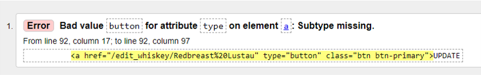

#### login.html

The following validation errors were discovered and then fixed during development.

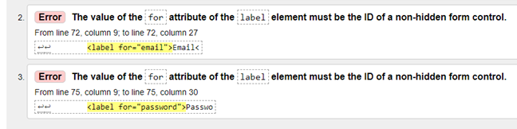

#### profile.html

The following validation errors were discovered and then fixed during development.

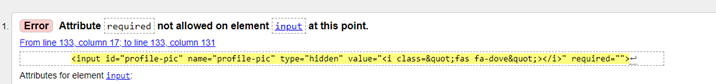
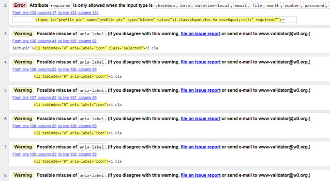
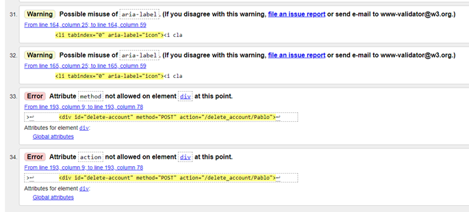

#### whiskey.html

The following validation errors were discovered and then fixed during development.

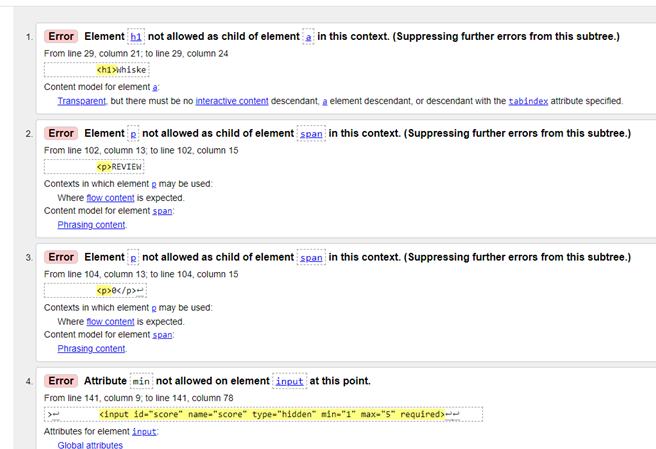
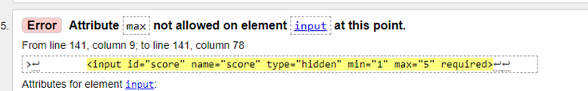
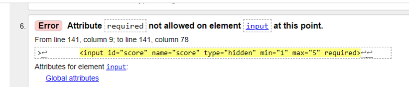
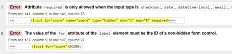

#### Deployed Website

The deployed website was validated near the end of the project. The following validation error was discovered and has been fixed.

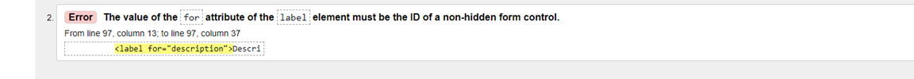

### CSS

All CSS was validated at [W3C CSS Validation Service](https://jigsaw.w3.org/css-validator/)

#### add-whiskey.css

The following validation errors were discovered and then fixed during development.

#### reviews.css

The following validation errors were discovered and then fixed during development.

### JavaScript

All JavaScript was validated at [JSHint](https://jshint.com/)

#### add-whiskey.js

The following validation errors were discovered and then fixed during development.

#### base.js

The following validation errors were discovered and then fixed during development.

#### profile.js

The following validation errors were discovered and then fixed during development.

#### whiskey.js

The following validation errors were discovered and then fixed during development.

### Python

All python was validated according to PEP8 standards at [PEP8 online](http://pep8online.com/) with the only errors being that the code exceeded the max
character length. These have been fixed.

## Bugs

On whiskey.html I found a bug during user story testing that I have not been able to fix yet.
When a user tries to update their review, some symbols that are inputted into the #leave-review form will be encoded.
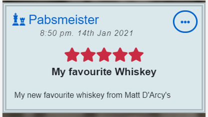
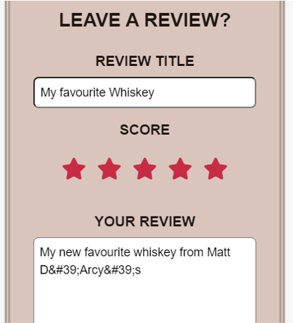

