# Whiskey Herald Wireframes

[Return to README](README.md)

## base.html

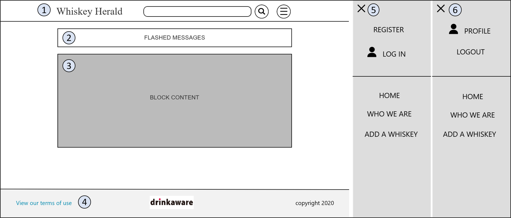
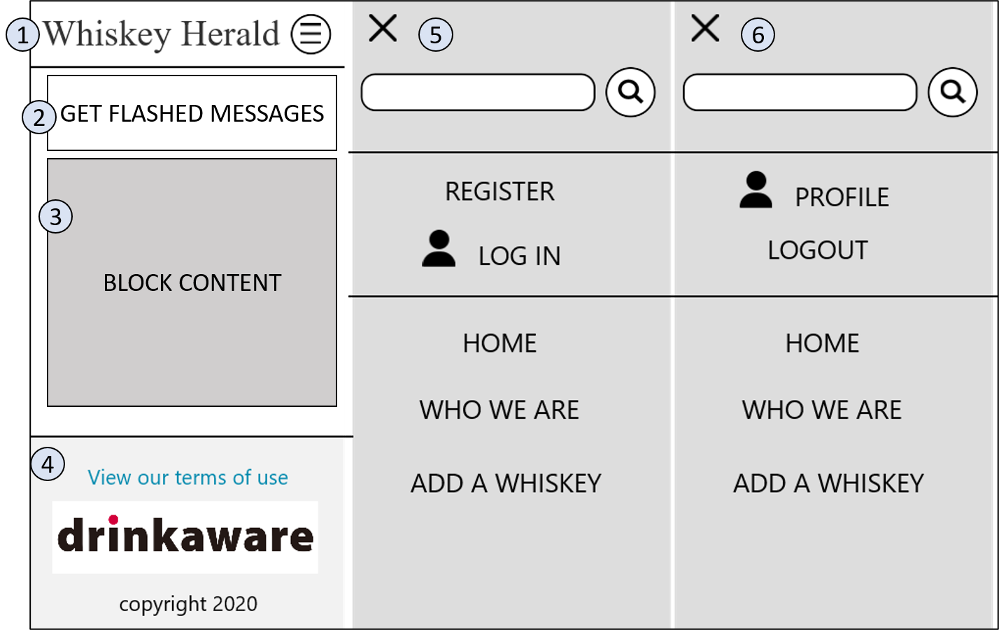

- [1]: Header. The header will contain the website logo, a search bar to allow users to search the database for whiskeys, and a menu icon to open the sidenav.
- [2]: Flashed messages will appear here.
- [3]: Content from other pages will be rendered here with Jinja templating.
- [4]: Footer: A link for a user to view the terms of use for this website, a link to drinkaware, and copyright 2020.
- [5]: The sidenav that appears when no user is logged in. On mobile view the search bar will move from the header onto the sidenav.
- [6]: The sidenav that appears when a user is logged in.

## index.html

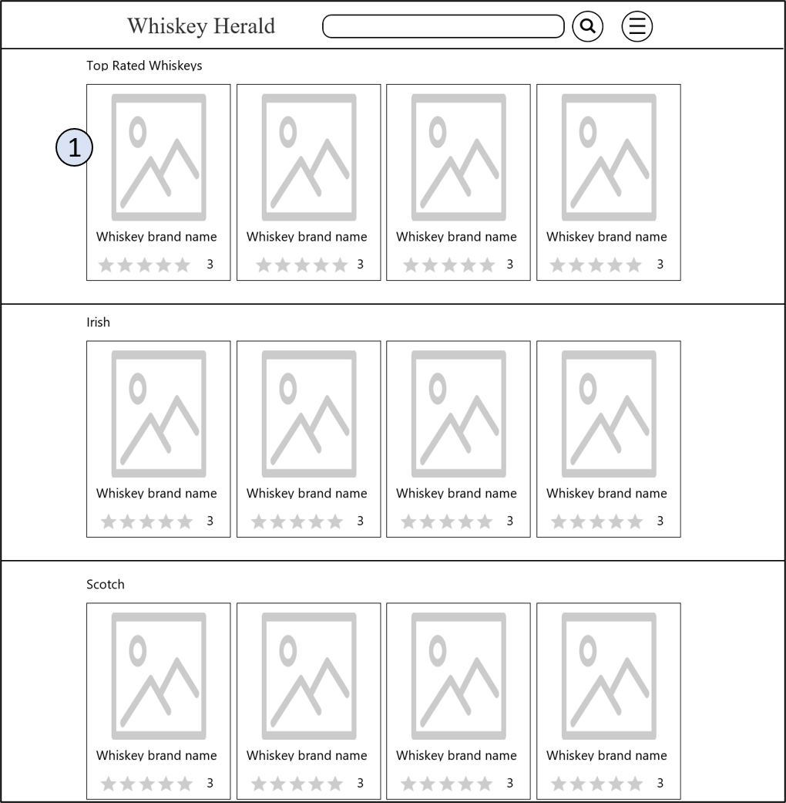
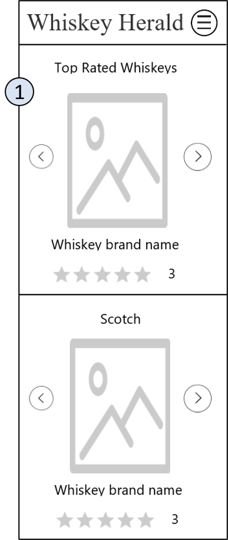

- [1]: Some carousels will be displayed with filtered results for different types of whiskeys. E.g. irish, scotch, bourbon, ect.

## about.html

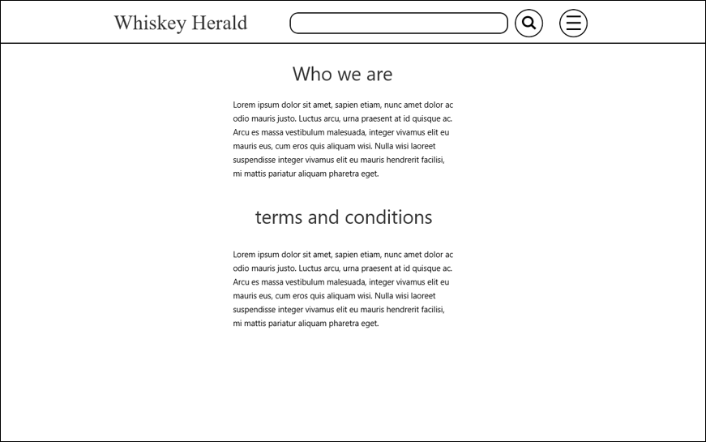
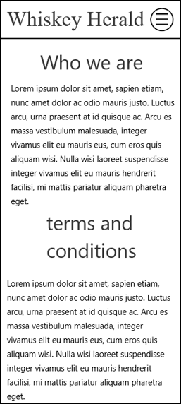

- [1]: information on who whiskey herald is, terms of use.

## add-whiskey.html

- [1]: A user can upload a photo to the static directory, and a path to the image location will be added to the database.
- [2]: Input whiskey name
- [3]: input whiskey type.
- [4]: input whiskey description.

## login.html

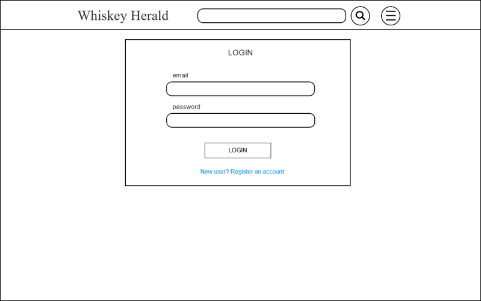
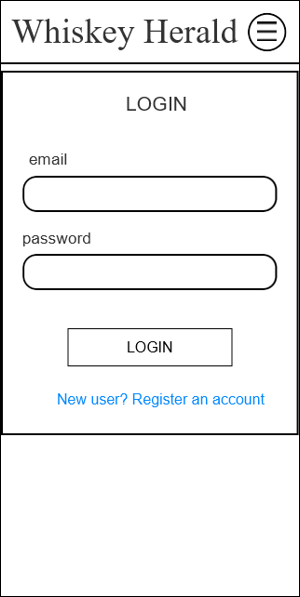

- [1]: user enters email
- [2]: user enters password
- [3]: if the user is not registered then this will bring them to register.html

## register.html

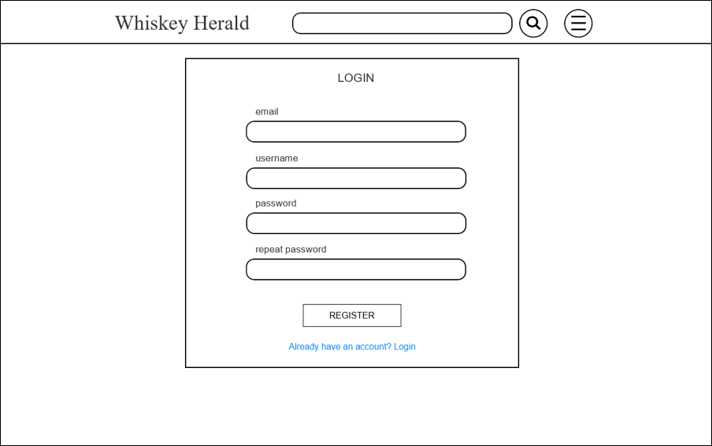
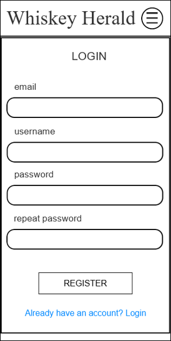

- [1] input email
- [2]: input username
- [3]: input password
- [4]: input password again
- [5]: If a user already has an account this will bring them to login.html

## whiskey.html

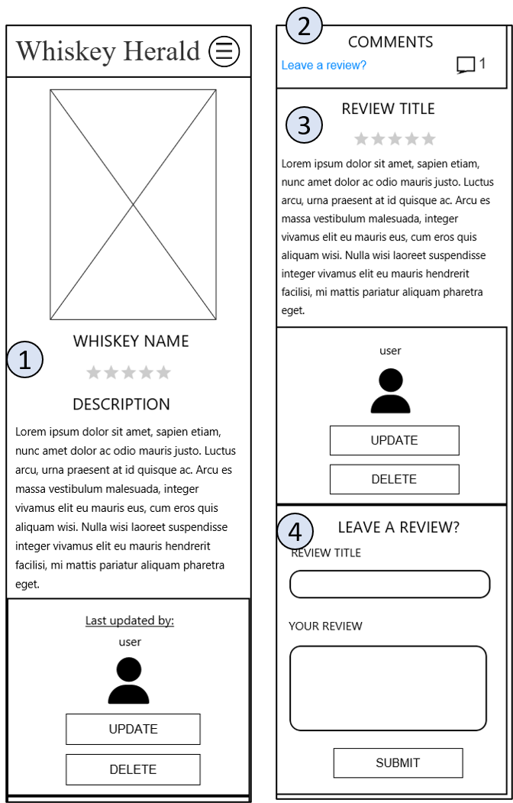

- [1]: Image of whiskey, its name, average score, description, the user who last updated the whiskey details and actions a user can take. For all users they can update, only the admin can delete.
- [2]: Start of reviews. A link to the bottom of page to leave a review. Number of reviews.
- [3]: The reviews have a title, a score, the review, the users name who left it, and for a user who is logged in, they can update or delete their review.
- [4]: leave a review. Give it a title, rating, and a review.

## profile.html

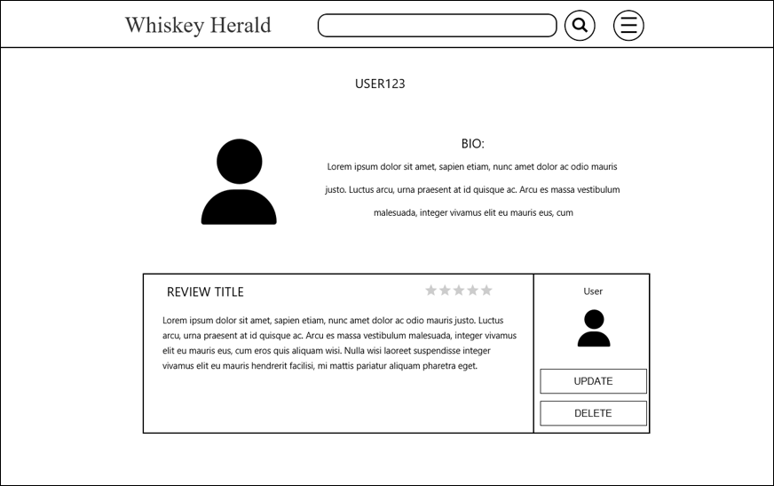
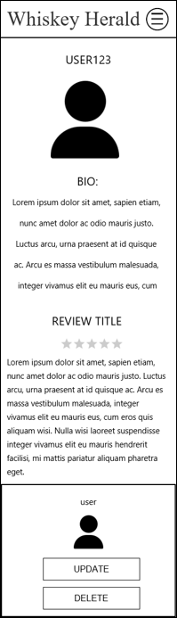

- [1]: Username, profile picture, bio
- [2]: list of reviews by this user.

## search.html

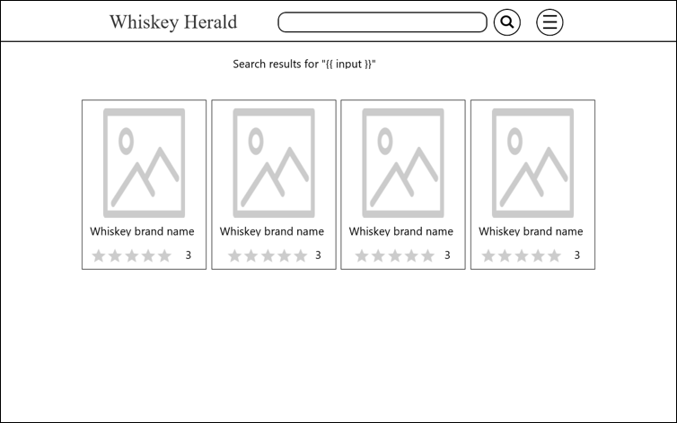
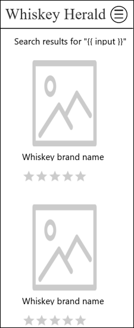

- [1]: search results for {{ input }}, or no results found for {{ input }}
- [2]: The search results for {{ input }}